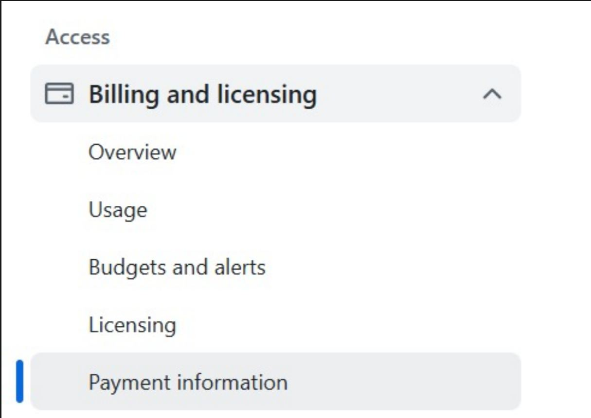
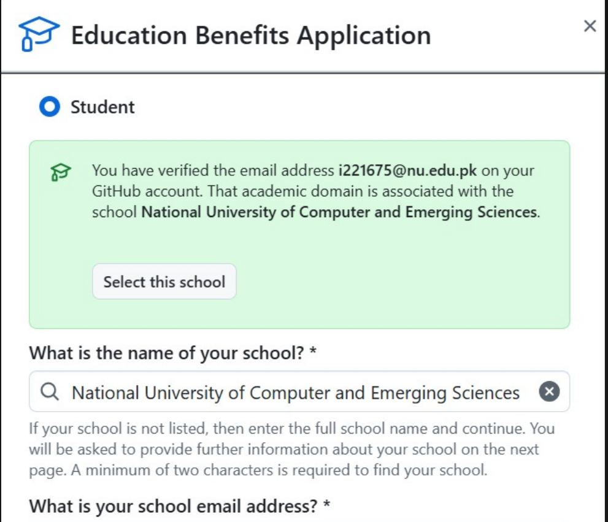
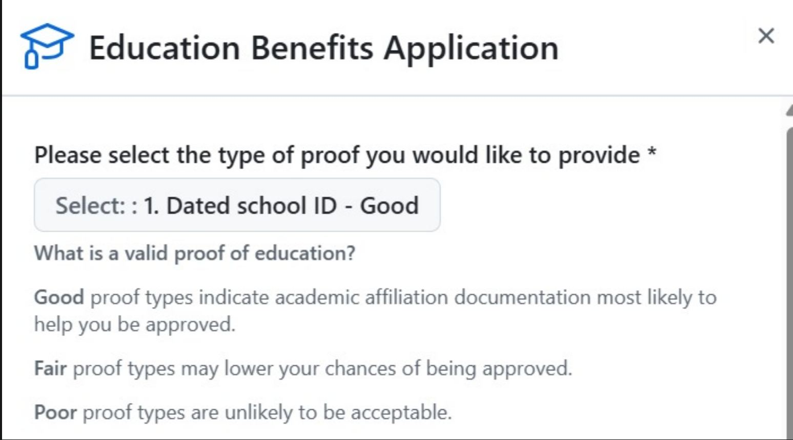

GitHub provides free access to GitHub Copilot for students through the GitHub Education program. Follow the steps below carefully to apply and activate the benefit.

---

## Step 1: Create a GitHub Account

1. Visit [https://github.com](https://github.com)
2. Create a new GitHub account
3. Use your official institute email address during signup

---

## Step 2: Enable Two-Factor Authentication (2FA)

Two-factor authentication is mandatory for GitHub Education.

1. Go to **Settings**
2. In the left sidebar, click **Password and authentication**
3. Enable **Two-factor authentication**
4. Choose a method such as:

   * Google Authenticator
   * GitHub Mobile App
5. Complete the setup process fully

---

## Step 3: Add Payment Information

This step is required for identity verification. No charges will be applied.

1. Go to **Settings**
2. Open **Billing and licensing**
3. Click **Payment information**
4. Fill in your details:

   * Full name (must exactly match the name on your institute ID card)
   * All other required information

5. Save the changes

---

## Step 4: Apply for GitHub Education Benefits

1. In **Settings**, select **Education benefits** from the left sidebar
2. Your institute may be auto-detected

   * If not, search and select it manually
3. Click **Next**

4. Share your location when prompted

---

## Step 5: Upload Institute ID Card

1. Choose the **photo upload** option
2. Upload a clear image of your institute ID card

   * Your name must be visible
   * Valid dates or enrollment details must be visible

3. Submit the application

---

## Step 6: Approval and Copilot Activation

* Approval is usually granted within 30 seconds

![]

* GitHub Copilot access will be enabled within 72 hours after approval
* Return to the **Education benefits** page
* Use the provided links to redeem and activate GitHub Copilot

---

## Notes

* Ensure your GitHub account email and institute ID card information match
* Approval time may vary slightly
* GitHub Copilot works with supported editors such as VS Code and JetBrains IDEs
